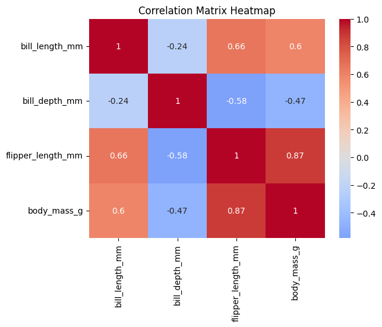
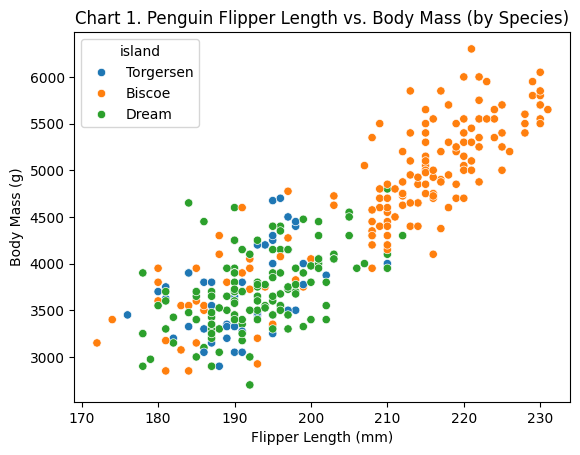
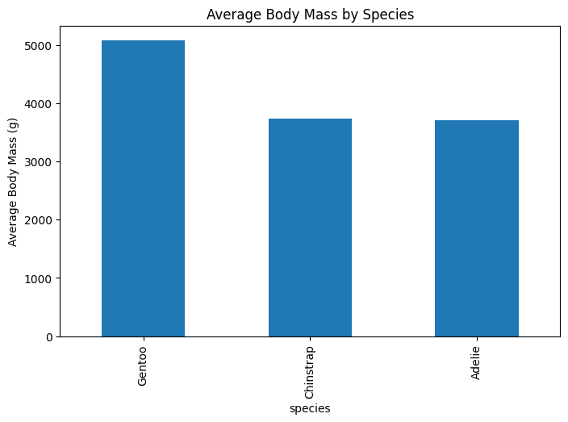

# datafun-04-notebooks

[](https://denisecase.github.io/pro-analytics-02/workflow-b-apply-example-project/)
[](./pyproject.toml)
[](./LICENSE)

> Professional Python project: exploratory data analysis with Jupyter notebooks.

Data analytics requires a variety of skills.
This course builds capabilities through working projects.

In the age of generative AI, durable skills are grounded in real work:
setting up a professional environment,
reading and running code,
understanding the logic,
and pushing work to a shared repository.
Each project follows the structure of professional Python projects.
We learn by doing.

## This Project

This project introduces **Exploratory Data Analysis (EDA)** using Jupyter notebooks.

When we encounter a new dataset, we want to explore quickly:
run checks, view distributions, identify missing values or outliers.
Notebooks combine Markdown narrative with Python code cells and are ideal for this kind of investigation.

You will run the example notebook, read the code and narrative,
and create your own notebook to explore a different tabular dataset.

## Working Files

You'll work with just these areas:

- **docs/** - the project narrative and documentation
- **src/datafun** - supporting Python module
- **notebooks/** - where the analysis happens
- **pyproject.toml** - update authorship & links
- **zensical.toml** - update authorship & links

## Instructions (pro-analytics-02)

Follow the
[step-by-step workflow guide](https://denisecase.github.io/pro-analytics-02/workflow-b-apply-example-project/)
to complete:

1. Phase 1. **Start & Run**
2. Phase 2. **Change Authorship**
3. Phase 3. **Read & Understand**
4. Phase 4. **Modify**
5. Phase 5. **Apply**

## Challenges

Challenges are expected.
Sometimes instructions may not quite match your operating system.
When issues occur, share screenshots, error messages, and details about what you tried.
Working through issues is part of implementing professional projects.

## Success

After completing Phase 1. **Start & Run**, you'll have your own GitHub project,
with the example notebook executed and committed,
and running the example script will print out:

```shell
========================
Executed successfully!
========================
```

A new file `project.log` will appear in the root project folder.

## Command Reference

The commands below are used in the workflow guide above.
They are provided here for convenience.

Follow the guide for the **full instructions**.

<details>
<summary>Show command reference</summary>

### In a machine terminal (open in your `Repos` folder)

After you get a copy of this repo in your own GitHub account,
open a machine terminal in your `Repos` folder:

```shell
# Replace username with YOUR GitHub username.
git clone https://github.com/kiruthikaa2512/datafun-04-notebooks

cd datafun-04-notebooks
code .
```

### In a VS Code terminal

These are listed for convenience.
For best results, follow the detailed instructions in
[pro-analytics-02 guide](https://denisecase.github.io/pro-analytics-02/)
to complete:

```shell
uv self update
uv python pin 3.14
uv sync --extra dev --extra docs --upgrade

uvx pre-commit install

git add -A
uvx pre-commit run --all-files
# repeat if changes were made
uvx pre-commit run --all-files

# run the module to verify the environment (.venv)
uv run python -m datafun.app_case

# do chores
uv run ruff format .
uv run ruff check . --fix
uv run python -m pyright
uv run python -m pytest
uv run python -m zensical build

# save progress
git add -A
git commit -m "update"
git push -u origin main
```

</details>

## Notes

- Use the **UP ARROW** and **DOWN ARROW** in the terminal to scroll through past commands.
- Use `CTRL+f` to find (and replace) text within a file.
- You do not need to add to or modify `tests/`. They are provided for example only.
- Many files are silent helpers. Explore as you like, but nothing is required.
- You do NOT not to understand everything; understanding builds naturally over time.

## Troubleshooting >>>

If you see something like this in your terminal: `>>>` or `...`
You accidentally started Python interactive mode.
It happens.
Press `Ctrl+c` (both keys together) or `Ctrl+Z` then `Enter` on Windows.

## Project Summary

```shell
2026-06-03 21:58:35 | INFO | EDA-NB | Dataset: penguins
2026-06-03 21:58:35 | INFO | EDA-NB | Original rows: 344
2026-06-03 21:58:35 | INFO | EDA-NB | Clean rows:    342
2026-06-03 21:58:35 | INFO | EDA-NB | Groups found in island: ['Biscoe', 'Dream', 'Torgersen']
2026-06-03 21:58:35 | INFO | EDA-NB | Key Findings:
2026-06-03 21:58:35 | INFO | EDA-NB |   Gentoo penguins have the highest average body mass.
2026-06-03 21:58:35 | INFO | EDA-NB |   Flipper length and body mass show a strong positive correlation.
2026-06-03 21:58:35 | INFO | EDA-NB |   Grouping by island reveals geographic differences in penguin characteristics.
2026-06-03 21:58:35 | INFO | EDA-NB | Suggested next step:
2026-06-03 21:58:35 | INFO | EDA-NB |   Model body_mass_g ~ flipper_length_mm with linear regression
2026-06-03 21:58:35 | INFO | EDA-NB | EDA workflow complete
2026-06-03 21:58:35 | INFO | EDA-NB | IMPORTANT: This script creates chart windows.
2026-06-03 21:58:35 | INFO | EDA-NB | Close any chart windows and terminate this process with CTRL+c as needed.
2026-06-03 21:58:35 | INFO | EDA-NB | ========================
2026-06-03 21:58:35 | INFO | EDA-NB | Executed successfully!
2026-06-03 21:58:35 | INFO | EDA-NB | ========================
```

## Findings and Visuals

## Custom Project

### Dataset

For this project, I used the Palmer Penguins dataset. The dataset contains measurements for Adelie, Chinstrap, and Gentoo penguins collected from the islands of Biscoe, Dream, and Torgersen. The available attributes include bill length, bill depth, flipper length, body mass, species, island, and sex.

### Signals

The primary signals used in this analysis were species, island, body mass, flipper length, bill length, and bill depth. I also explored average body mass across species and examined correlations among numerical measurements to better understand relationships within the dataset.

### Experiments

To customize the original notebook, I focused on exploring penguin characteristics through new visualizations and island-based grouping. I created the following visualizations:

1. Average Body Mass by Species
2. Flipper Length vs. Body Mass
3. Correlation Matrix Heatmap

I also updated the notebook summary and README documentation to reflect my findings and interpretations.

### Results

The analysis showed that Gentoo penguins have the highest average body mass among the three species. I observed a strong positive relationship between flipper length and body mass, indicating that larger penguins generally have longer flippers. The correlation heatmap confirmed that flipper length and body mass have the strongest relationship among the numerical variables. Island-based grouping also revealed differences in penguin populations across locations.

### Interpretation

This project reinforced how exploratory data analysis can be used to identify patterns and relationships within a dataset. The findings suggest that physical measurements such as flipper length can be useful indicators of body mass. Exploring the data by island also demonstrated how location can influence population characteristics. Overall, the project helped me practice data exploration, visualization, interpretation, and documentation using Python and Jupyter notebooks.


### Average Body Mass by Species



This chart compares the average body mass of the three penguin species. I found that Gentoo penguins have the highest average body mass, at approximately 5,000 grams, while Adelie and Chinstrap penguins have considerably lower average body mass values. This suggests that Gentoo penguins are generally larger and heavier than the other species in the dataset.

### Flipper Length vs. Body Mass



This scatter plot shows the relationship between flipper length and body mass. I observed a strong positive relationship between these two variables, meaning that penguins with longer flippers tend to have higher body mass. The data also shows visible clustering among species, particularly Gentoo penguins, which tend to have both longer flippers and greater body mass.

### Correlation Matrix Heatmap



The correlation heatmap summarizes the relationships among the numerical variables in the dataset. The strongest positive correlation is between flipper length and body mass (0.87), indicating a strong linear relationship. Bill length also shows a moderate positive relationship with body mass, while bill depth has a negative relationship with several variables. This visualization helped identify which measurements are most strongly associated with penguin size and highlighted variables that may be useful for future predictive analysis.
